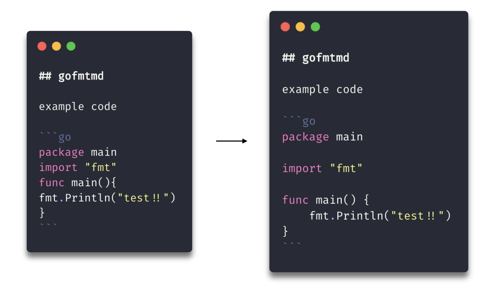

# vim-gofmtmd



in development ...

vim-gofmtmd formats go source code block in Markdown. detects fenced code & formats code using gofmt.

## Requirements

[gofmtmd](https://github.com/po3rin/gofmtmd)

## Usage

```bash
:GoFmtMd
```
