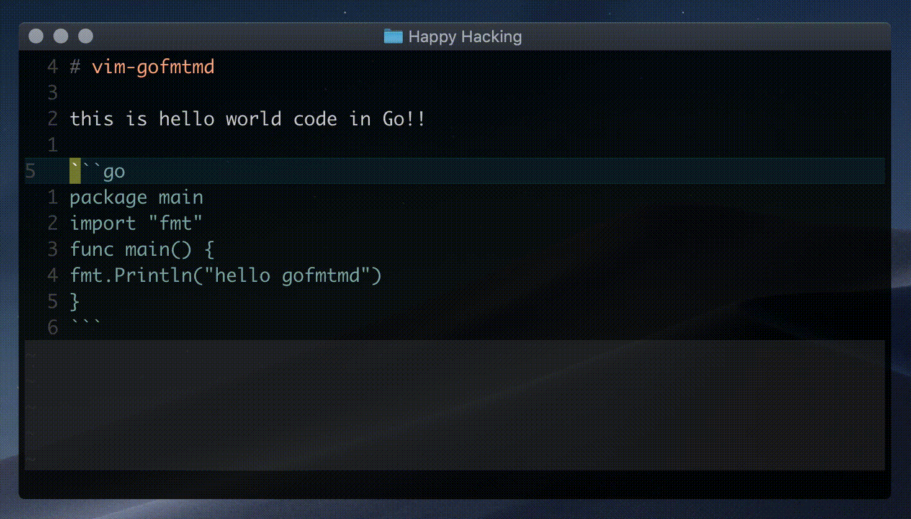

# vim-gofmtmd

[](https://circleci.com/gh/po3rin/vim-gofmtmd)



vim-gofmtmd formats go source code block in Markdown. detects fenced code & formats code using gofmt.

## Requirements

[gofmtmd](https://github.com/po3rin/gofmtmd)

## Inatall

First of all, you should install gofmtmd.

<a href="https://github.com/po3rin/gofmtmd"></a>

```bash
go get github.com/po3rin/gofmtmd/cmd/gofmtmd
```

if you have not installed Go language. please install from release page.
https://github.com/po3rin/gofmtmd/releases

you can use plugin.

```vim
" ex) if you use vim-plug (https://github.com/junegunn/vim-plug)
call plug#begin()
Plug 'po3rin/vim-gofmtmd' "add plugin here!!
let g:lsp_async_completion = 1
call plug#end()
```

## Usage

command

```bash
:GoFmtMd
```

## Option
You can set following option to enable auto format when save file.

`let g:gofmtmd_auto_fmt = 1`

